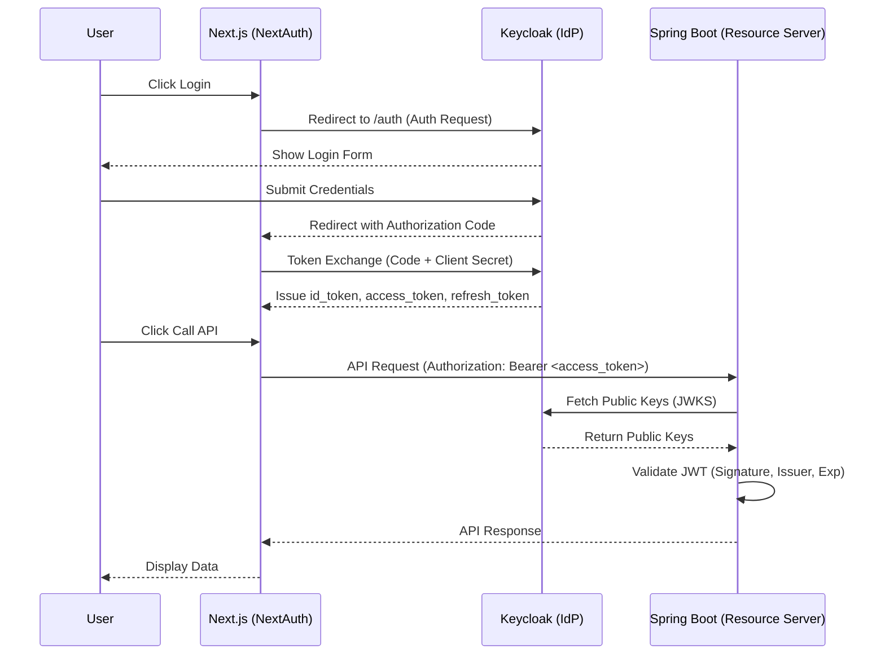

# OIDC Authentication Lab

Full-stack authentication example using Next.js, Spring Boot, and Keycloak.

## Architecture

1.  **Frontend (Next.js)**: Acts as an OIDC Client. Uses NextAuth to handle the Authorization Code Flow with Keycloak.
2.  **IdP (Keycloak)**: Handles user authentication and issues JWT tokens.
3.  **Backend (Spring Boot)**: Acts as an OAuth2 Resource Server. Validates JWT tokens issued by Keycloak.

## Prerequisites

- Docker and Docker Compose
- Java 17
- Node.js 18+

## Setup & Run

### 1. Start Services

```bash
docker compose up -d
```
- Frontend: `http://localhost:3000`
- Backend: `http://localhost:8080`
- Keycloak: `http://localhost:8081`

## Test the Flow

1.  Open `http://localhost:3000`.
2.  Click **Login with Keycloak**.
3.  Login with:
    - Username: `testuser`
    - Password: `password`
4.  Once logged in, click **Call Spring Boot API**.
5.  Observe the backend response containing your user info from the JWT.

---

## Token Flow Explanation



1.  **Authorization Request**: Frontend redirects user to Keycloak (`/auth`).
2.  **Authentication**: User enters credentials in Keycloak.
3.  **Authorization Code**: Keycloak redirects back to Frontend with a short-lived `code`.
4.  **Token Exchange**: NextAuth (server-side) sends the `code` + `client_secret` to Keycloak's `/token` endpoint.
5.  **Tokens Issued**: Keycloak returns:
    - `id_token`: Contains user profile info for the frontend.
    - `access_token`: JWT used to authorize API calls.
    - `refresh_token`: Used to get new tokens without re-login.
6.  **API Call**: Frontend sends the `access_token` in the `Authorization: Bearer <token>` header to Spring Boot.

## JWT Validation in Spring Boot

Spring Boot validates the token by:
1.  **Signature Verification**: It fetches the Public Keys (JWKS) from `http://localhost:8080/realms/demo/protocol/openid-connect/certs`.
2.  **Issuer Check**: Ensures the `iss` claim matches the configured issuer URI.
3.  **Expiration Check**: Ensures the `exp` claim is in the future.
4.  **Audience Check**: (Optional) Ensures the token was intended for this service.

## Common Issues & Debugging

- **CORS Errors**: Ensure the backend `SecurityConfig` allows `http://localhost:3000`.
- **JWT Issuer Mismatch**: Ensure `spring.security.oauth2.resourceserver.jwt.issuer-uri` exactly matches the `iss` claim in the token (check with [jwt.io](https://jwt.io)).
- **Internal Docker Networking**: If services run inside Docker, use service names (e.g., `http://keycloak:8080`) instead of `localhost`. In this lab, we assume all services run on the host network for simplicity.
- **NextAuth Secret**: If you get "Encryption" errors in NextAuth, ensure `NEXTAUTH_SECRET` is set.
